# Sequence diagrams
The number between brackets represents the message code. Some messages have a value between parentheses at the end, that represents an internal code/value for that message.

- [Login Server](#login-server)
    - [Authentication](#authentication)
        - [Login](#login)
- [Game Server](#game-server)
    - [Authentication](#authentication-1)
        - [Login](#login-1)
        - [Logout](#logout)
    - [Switch to stage on same server](#switch-to-stage-on-same-server)
        - [Disconnect](#disconnect)
        - [Connect](#connect)
    - [Switch to stage on different server](#switch-to-stage-on-different-server)
        - [Disconnect](#disconnect-1)
        - [Connect](#disconnect-1)
    - [Chat](#chat)
        - [Say](#say)
    - [Inventory](#inventory)
        - [Move](#move)
        - [Split](#split)
        - [Destroy](#destroy)
        - [Use (consumables)](#use-consumables)
    - [Interactions](#interactions)
        - [Talk to NPC](#talk-to-npc)
# Login server
## Authentication
### Login
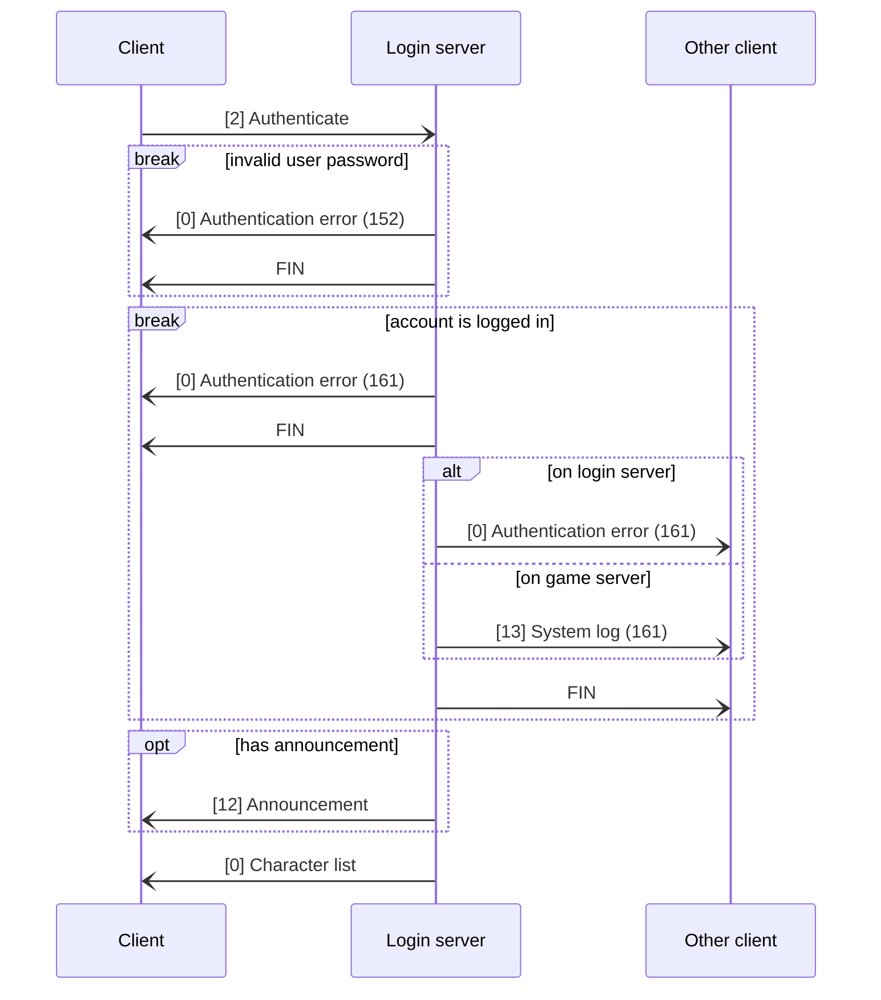
# Game server
## Authentication
### Login
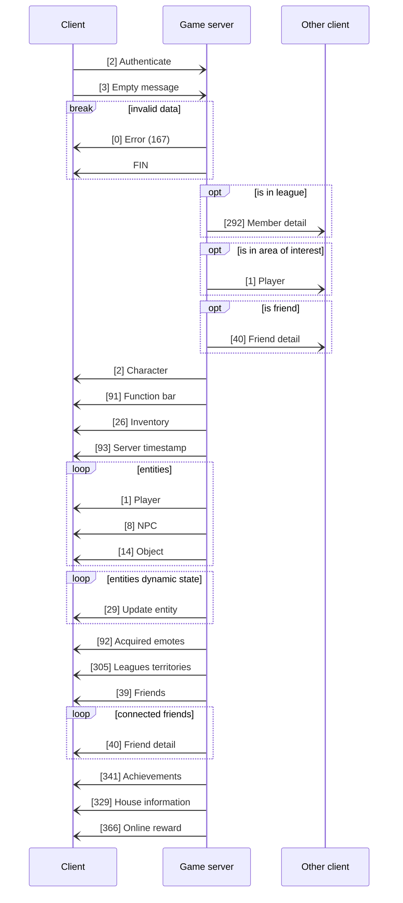

### Logout
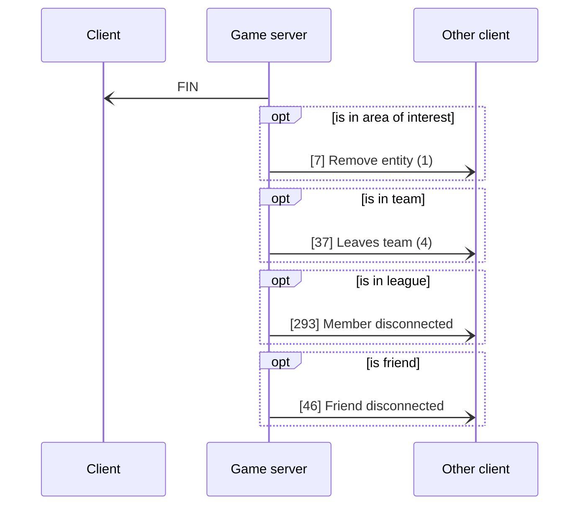
---
## Switch to stage on same server
### Disconnect
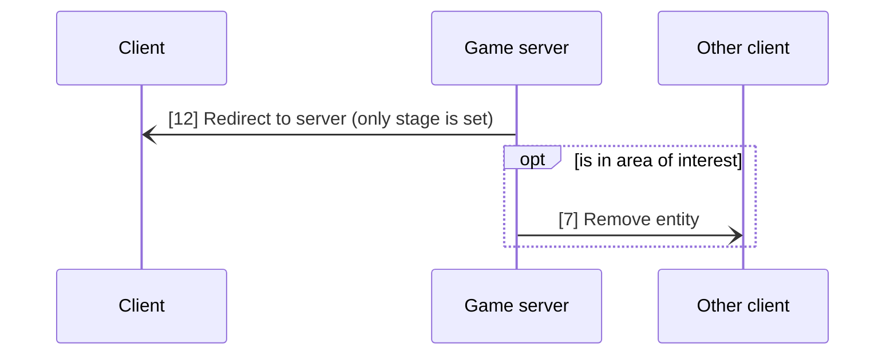
### Connect
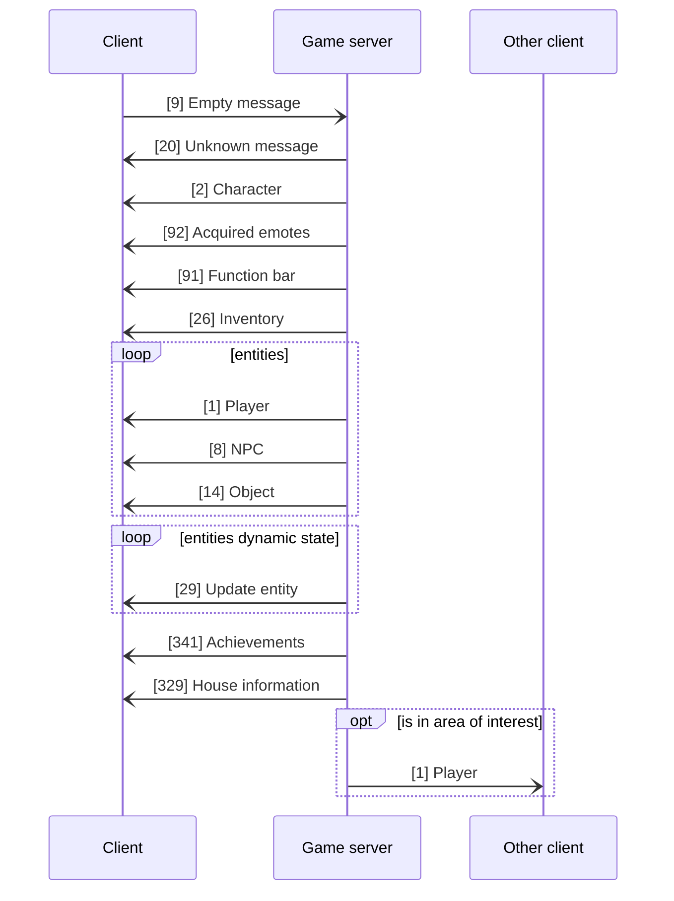
---
## Switch to stage on different server
### Disconnect
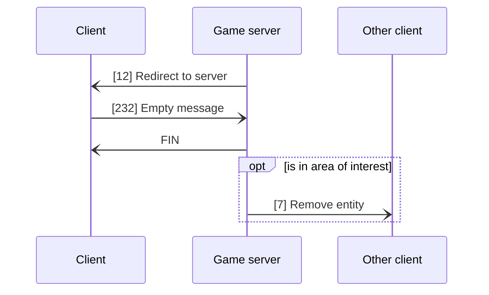

### Connect
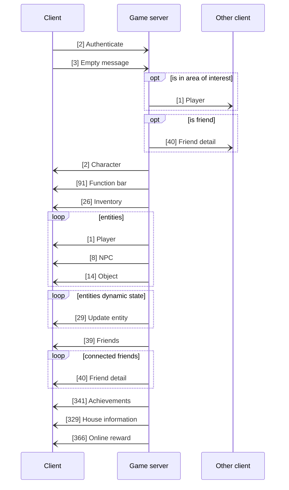
---

## Chat
### Say
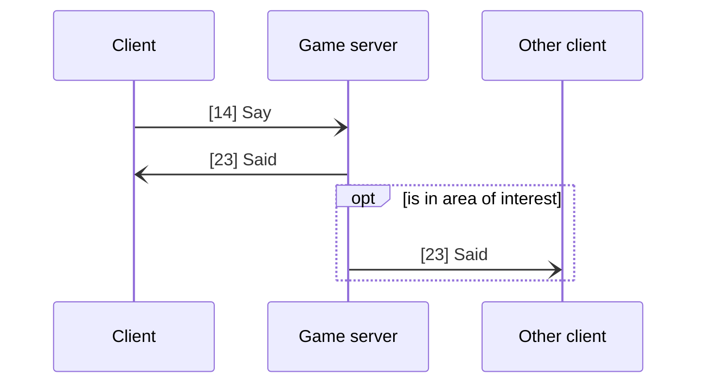

---

## Inventory
### Move
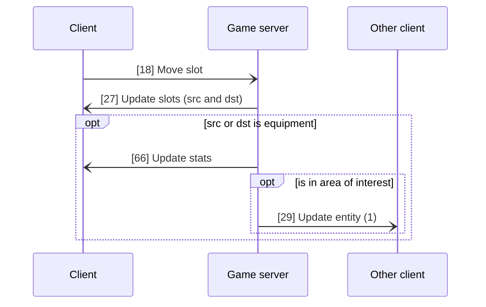

The `Update slots` message contains the state of the source and destination slots.

If the destination slot is empty, then becomes the slot for the item, and source becomes an empty slot.

If the destination slots contains the same item (code) and is quantifiable, then the slots are merged and the source becomes an empty slot.

If the destination slots contains a different item, then the slots are swapped.

### Split
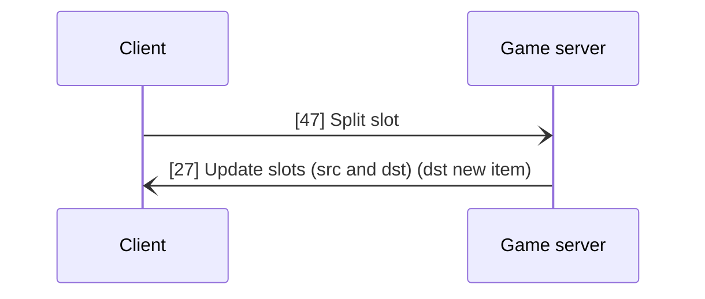

The `Update slots` message contains the state of the source and destination slots. The destination slot is a new item (new id) containing the specified amount of items. The source is updated with the remaining amount.

### Destroy
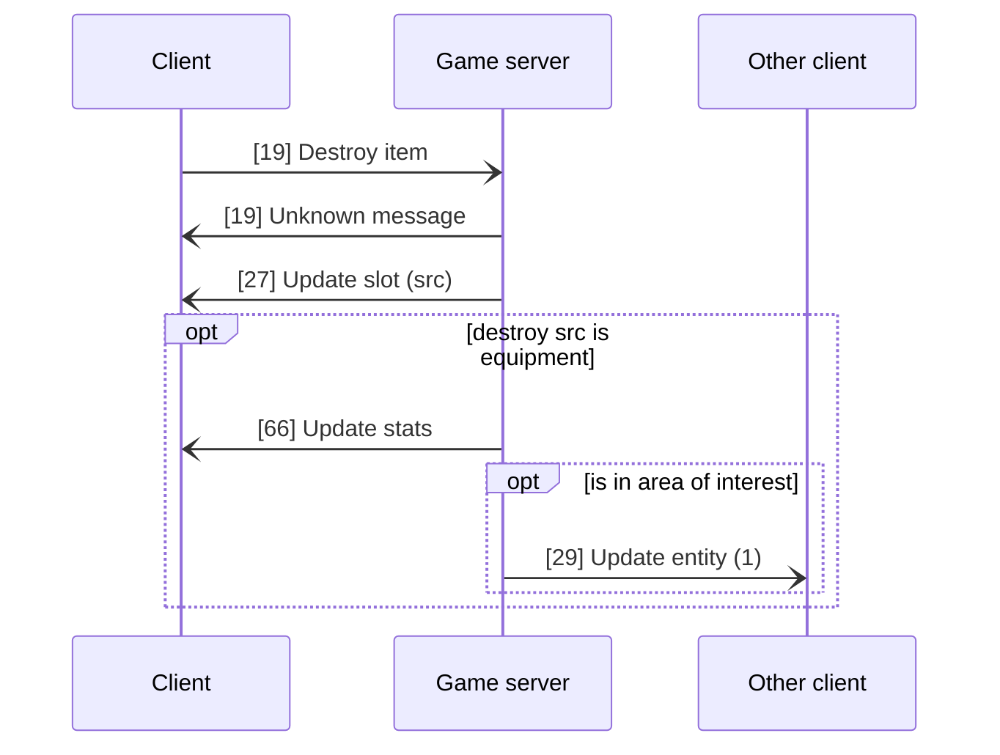

### Use (consumables)
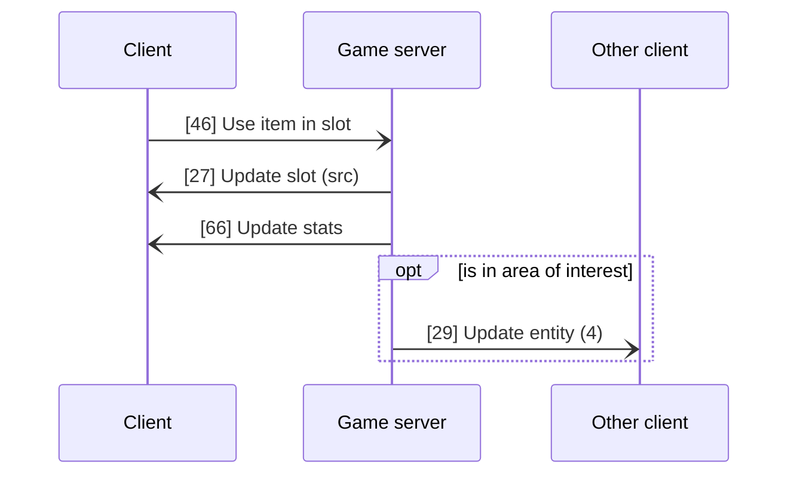

---

## Interactions

### Talk to NPC

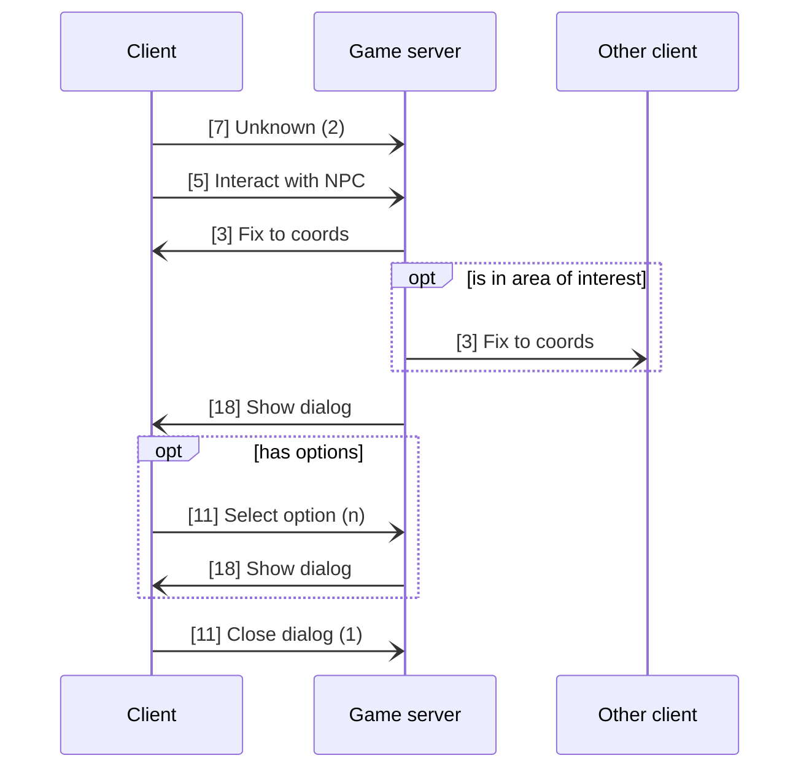