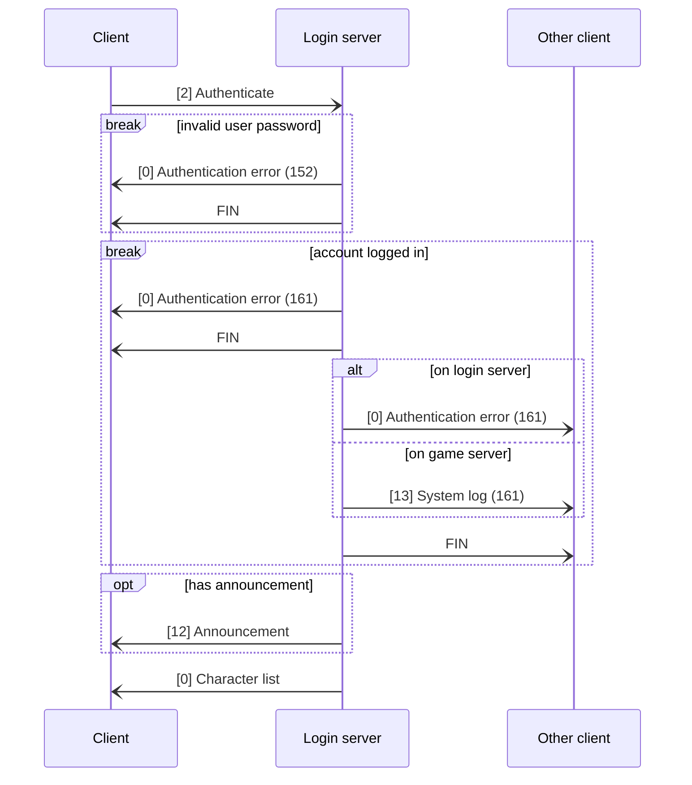
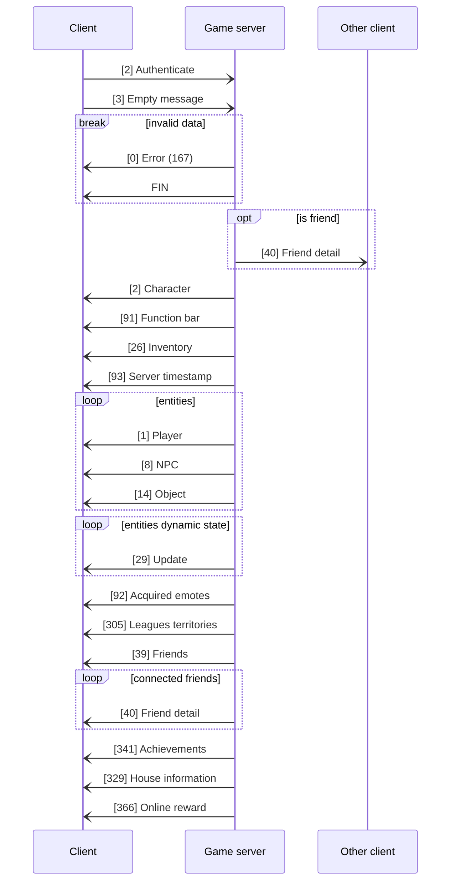

# Authentication (login server)

```mermaid
sequenceDiagram
    participant Client
    participant Login server
    participant Other client
    Client-)Login server: [2] Authenticate
    break invalid user password
    Login server-)Client: [0] Authentication error (152)
    Login server-)Client: FIN
    end
    break account logged in
    Login server-)Client: [0] Authentication error (161)
    Login server-)Client: FIN
    alt on login server
    Login server-)Other client: [0] Authentication error (161)
    else on game server
    Login server-)Other client: [13] System log (161)
    end
    Login server-)Other client: FIN
    end
    opt has announcement
    Login server-)Client: [12] Announcement
    end
    Login server-)Client: [0] Character list
```

# Authentication (game server)

```mermaid
sequenceDiagram
    participant Client
    participant Game server
    participant Other client
    Client-)Game server: [2] Authenticate
    Client-)Game server: [3] Empty message
    break invalid data
    Game server-)Client: [0] Error (167)
    Game server-)Client: FIN
    end
    opt is friend
    Game server-)Other client: [40] Friend detail
    end
    Game server-)Client: [2] Character
    Game server-)Client: [91] Function bar
    Game server-)Client: [26] Inventory
    Game server-)Client: [93] Server timestamp
    loop entities
    Game server-)Client: [1] Player
    Game server-)Client: [8] NPC
    Game server-)Client: [14] Object
    end
    loop entities dynamic state
    Game server-)Client: [29] Update
    end
    Game server-)Client: [92] Acquired emotes
    Game server-)Client: [305] Leagues territories
    Game server-)Client: [39] Friends
    loop connected friends
    Game server-)Client: [40] Friend detail
    end
    Game server-)Client: [341] Achievements
    Game server-)Client: [329] House information
    Game server-)Client: [366] Online reward
```

