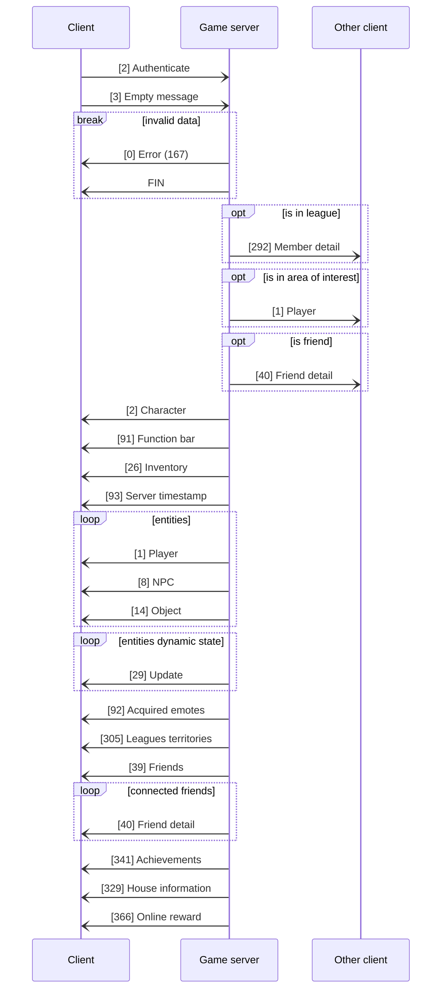

# Sequences diagrams
The number between brackets represents the message code. Some messages have a value between parentheses at the end, that represents an internal code/value for that message.

- [Login Server](#login-server)
    - [Authentication](#authentication)
        - [Login](#login)
- [Game Server](#game-server)
    - [Authentication](#authentication-1)
        - [Login](#login-1)
        - [Logout](#logout)
    - [Switch to stage on same server](#switch-to-stage-on-same-server)
        - [Disconnect](#disconnect)
        - [Connect](#connect)
    - [Switch to stage on different server](#switch-to-stage-on-different-server)
        - [Disconnect](#disconnect-1)
        - [Connect](#disconnect-1)

# Login server
## Authentication
### Login

# Game server
## Authentication
### Login

### Logout

---
## Switch to stage on same server
### Disconnect

### Connect

---
## Switch to stage on different server
### Disconnect

### Connect
